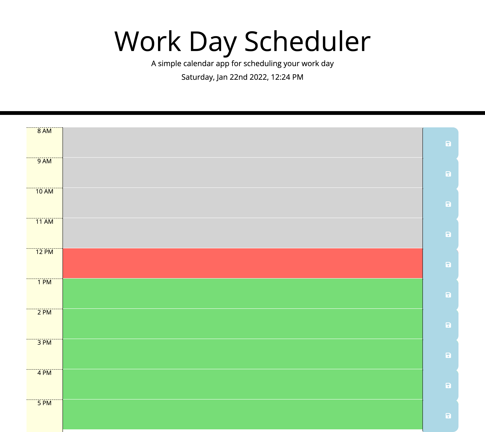
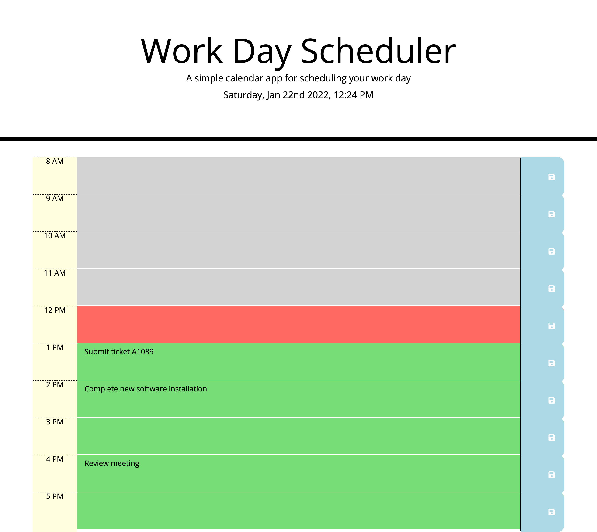
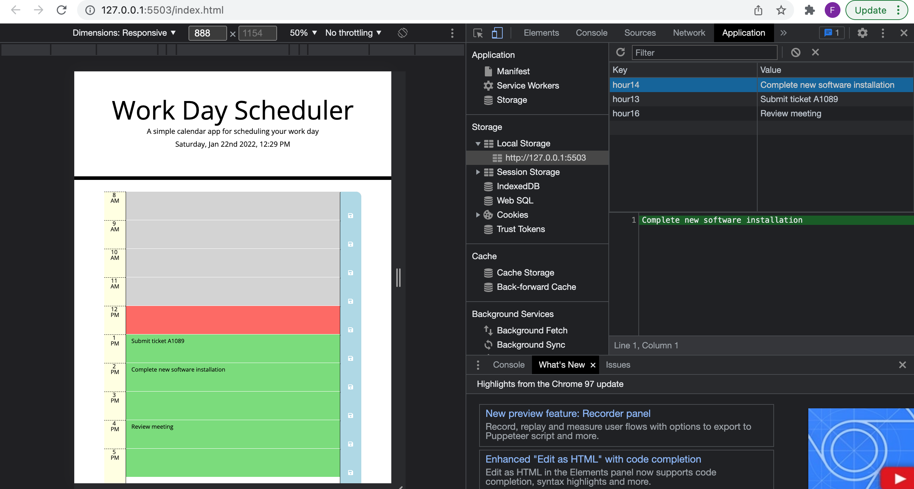

# WorkPlanner

Created a simple calendar application that allows a user to save events for each hour of the day by modifying a starter code. This app will run in the browser and feature dynamically updated HTML and CSS powered by jQuery.

Why did I build this project?

I build this application so that I could further enhance my skills in javascript that I have been working on the past few weeks. Examples include: variables, functions, loops, if statements. I was also able to use jquery as a tool to simply my code and do the heavy lifting and make it easier to write javascript.

What does this project solve?

This projects solves my ability in creating an interactive application on the browser with the skills I have learned so far. It also allows for any user to use this application plan events on a calender to organise their work day.

So far I have achieved?

1. Creating the format for the work schedule calender using html and css. Modying the starter code. This was done mainly by creating time blocks in the html file linking it to classes on the css stylesheet. Each time block represented an 8am-5pm work schedule.

2. Users are able to input data in to the calender as events.

3. Live current date and time is displayed on top of the page in the calender schedule. This was created using moment.js format.

4. The planner highlights whether the event scheduled in each time block is either in the past, present or future using 3 different colours. Grey to present the past, red to present the present moment, and green to present the future. This was created using if statements.

5. Users are able to save their event inputs when clicking the save button in local storage.

6. The event input persist on the page even after the page is refreshed. for the day. This was acheieved by retreiving items from local storage.

What I intend to add in the near future?

1. Create a loop to identify which part of the timeblock is in the past, present or future with color code identfication. This is so that the readability of the code is better. So far, the code that was created for this section takes up a lot of space. I would like to build on my knowledge and skill set to achieve this is.

Criteria set to achieve this?

```
GIVEN I am using a daily planner to create a schedule
WHEN I open the planner
THEN the current day is displayed at the top of the calendar

WHEN I scroll down
THEN I am presented with timeblocks for standard business hours

WHEN I view the timeblocks for that day
THEN each timeblock is color coded to indicate whether it is in the past, present, or future

WHEN I click into a timeblock
THEN I can enter an event

WHEN I click the save button for that timeblock
THEN the text for that event is saved in local storage

WHEN I refresh the page
THEN the saved events persist
```

To access this project the following links are provided:

To access Github Repository

1. https://github.com/Farhiya1/JavaScript-Quiz

To access Application deployed at live URL

2. https://farhiya1.github.io/JavaScript-Quiz/

Screenshot changes made can be found in images
Screenshot of deployed application

1. Screenshot displaying work schedule indicating coloured timeblocks andlive date and time on top of the page



2. Screenshot displaying events entery on calender based on input in text area.
   

3. Screenshot displaying events persisting on page even after rthe page was refreshed. This is also evident with the time difference between this image and screenshot 2 above.


4. Screenshot displaying events saved in local storage.
   

References

1. https://fontawesome.com/v5.15/icons/save?style=solid
2. https://getbootstrap.com/docs/4.0/layout/grid/
3. https://www.w3schools.com/jquery/html_html.asp
4. https://www.sitepoint.com/jquery-each-function-examples/
5. https://birmingham.bootcampcontent.com/university-of-birmingham/
   UBHM-VIRT-FSF-PT-11-2021-U-LOL
6. https://developer.mozilla.org/en-US/docs/Web/JavaScript/ ReferenceStatements/if...else
7. https://momentjs.com/

```

```
